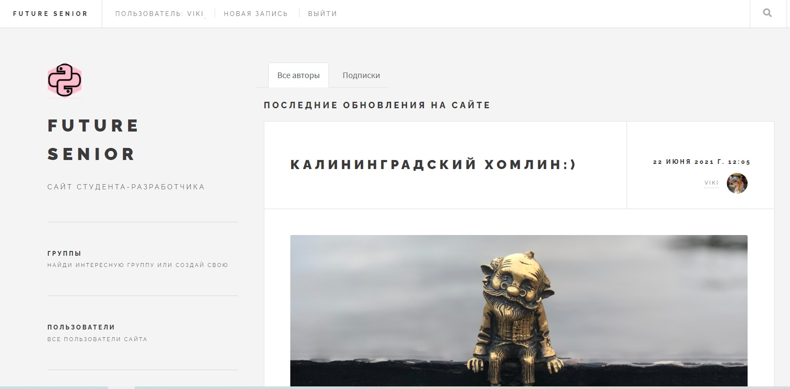

<h1>Блог future senior</h1>
Проект задеплоен на python-anywhere, посмотреть, протестировать и оставить комментарий можно здесь: <h3>http://futuresenior.pythonanywhere.com/</h3>


<h3>Future Senior - это улучшенная версия учебного <a href="https://github.com/Viktrols/blog-yatube-yandex-praktikum">проекта</a>, созданного в рамках обучения на курсе Python-разработчик от Я.Практикум</h3>
<h2>Проект позволяет</h2>

<li>регистрироваться и логиниться, восстанавливать пароль по почте</li>
<li>создавать, редактировать, удалять свой профиль (аватар, описание)</li>
<li>создавать, редактировать, удалять и просматривать свои группы</li>
<li>создавать, редактировать, удалять свои записи</li>
<li>просматривать страницы других пользователей</li>
<li>комментировать записи других авторов</li>
<li>подписываться на авторов, просматривать список подписок и подписчиков</li>
<li>Ставить и убирать лайки на публикации</li>
Модерация записей осуществляется через встроенную панель администратора

<h2>Используемые технологии</h2>
<li>Django 2.2</li>
<li>Python 3.8</li>
<li>SQLite</li>
<li>HTML/CSS</li>
<h2>Установка проекта:</h2>

### Клонируйте данный репозиторий
```git clone https://github.com/Viktrols/blog-yatube-yandex-praktikum.git```
### Создайте и активируйте виртуальное окружение
```
python -m venv venv<br>
source ./venv/Scripts/activate  #для Windows
source ./venv/bin/activate      #для Linux и macOS
```
### Установите требуемые зависимости
```
pip install -r requirements.txt
```
### Примените миграции
```
python manage.py migrate
```
### Запустите django-сервер
```
python manage.py runserver
```

### Приложение будет доступно по адресу: http://127.0.0.1:8000/


